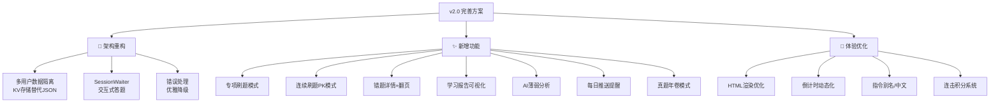

# 高考金牌私教插件 v2.0 — 全面完善方案

基于当前 1686+ 道客观题 + 主观题数据库，以及 AstrBot v4.22 API 能力，对插件进行全面重构升级。

## User Review Required

> [!IMPORTANT]
> 以下重构涉及较大改动，请确认方向后再执行。

> [!WARNING]
> 升级后数据格式变化，旧版 `user_progress.json` / `user_scores.json` 将自动迁移。用户无感。

---

## 问题诊断：当前版本的核心缺陷

| 缺陷 | 影响 |
|------|------|
| **全局共享数据** — 所有用户共享一份 `user_progress` / `user_scores` | 多人同时用时数据互相覆盖 |
| **JSON 文件持久化** — 每次操作全量读写 JSON | 性能差、并发不安全 |
| **无交互式答题** — 必须手动 `/答 A`，不支持直接回复 | 体验割裂 |
| **错题本无详情** — 只显示数量，不能查看/翻页 | 无法针对性复习 |
| **成绩单单薄** — 仅文字，无可视化 | 看不到进步趋势 |
| **无专项练习** — 不能按题型/年份/分值专项刷 | 无法针对薄弱环节 |
| **daily_push_task 空跑** — 每小时循环但什么也不做 | 浪费资源 |

---

## 完善方案总览



---

## 详细设计

### 模块一：架构重构 — 多用户隔离 + KV 存储

**核心问题**：当前所有用户共用一份 `self.user_progress` 和 `self.user_scores`，多人使用时数据混乱。

#### 方案：使用 AstrBot KV 存储（按插件隔离，天然安全）

```python
# 存储 key 规范: "{user_id}:progress", "{user_id}:scores"
async def _get_user_data(self, user_id, key, default):
    data = await self.get_kv_data(f"{user_id}:{key}", default)
    return data

async def _set_user_data(self, user_id, key, value):
    await self.put_kv_data(f"{user_id}:{key}", value)
```

每个用户独立的数据结构：
- `{user_id}:progress` — 做题进度、错题本
- `{user_id}:scores` — 各科成绩、分类统计
- `{user_id}:settings` — 个人设置（当前科目等）
- `{user_id}:streak` — 连续打卡记录

---

### 模块二：交互式答题 — SessionWaiter

**核心改进**：使用 `session_waiter` 实现「出题 → 等待回答 → 自动批改」流畅体验，不再需要 `/答` 前缀。

```python
@filter.command("刷题")
async def quiz(self, event: AstrMessageEvent, ...):
    # 出题
    yield event.image_result(url)  # 发送题目
    
    @session_waiter(timeout=300, record_history_chains=False)
    async def wait_answer(controller, event):
        user_ans = event.message_str
        if user_ans == "跳过":
            controller.stop()
            return
        # 直接批改，不需要 /答 前缀
        result = self._grade(item, user_ans)
        await event.send(event.plain_result(result))
        controller.stop()
    
    await wait_answer(event)
```

用户体验变化：
- **之前**：`/刷题` → 手动输入 `/答 A`
- **之后**：`/刷题` → 直接发 `A` 或答案文字 → 自动批改

---

### 模块三：新增功能

#### 1. 专项刷题 `/专项`

按多维度筛选题目：

```
/专项 数学 2023      → 2023年数学真题
/专项 物理 选择题    → 物理选择题专练  
/专项 英语 完形填空  → 英语完形填空
```

#### 2. 模拟考试 `/模考`

从题库抽取一套完整试卷，限时作答：

```
/模考 数学 → 抽取 12道选择 + 4道填空 + 5道大题
           → 限时 120 分钟
           → 答完自动出分 + AI点评
```

#### 3. 连续刷题 PK 模式 `/闯关`

连续答题，答对继续，答错结束：

```
/闯关 → 第1题... 答对 ✅ 连击 ×1
      → 第2题... 答对 ✅ 连击 ×2
      → 第3题... 答错 ❌ 闯关结束！本次闯过 2 关
```

#### 4. 错题详情 + 翻页 `/错题`

```
/错题 → 显示错题列表（每页5题）
/错题 2 → 翻到第2页
/错题 复习 → 进入错题复习模式（连续重做）
```

#### 5. 学习报告可视化 `/报告`

用 HTML 渲染精美成绩卡片：

- 各科正确率雷达图（用 CSS 绘制）
- 7天做题趋势折线
- 薄弱知识点标红
- 连续打卡天数 / 最长连击记录

#### 6. AI 薄弱分析 `/诊断`

基于做题数据让 AI 生成个性化学习建议：

```
/诊断 → AI 分析你的各科数据：
  📊 数学正确率 45%，主要错在圆锥曲线和概率
  📌 建议：先巩固基础公式，再刷 2020-2022 年圆锥曲线专题
```

#### 7. 每日推送 `/订阅`

```
/订阅 → 开启每日推送
       → 每天 8:00 推送1道错题 + 高考倒计时
/取消订阅 → 关闭推送
```

---

### 模块四：体验优化

#### 1. 指令别名（降低使用门槛）

| 主指令 | 别名 |
|--------|------|
| 高考帮助 | 帮助、help |
| 选科 | 切换科目 |
| 刷题 | 做题、来一题、抽题 |
| 答 | 提交、回答 |
| 解析 | 讲解、分析 |
| 错题本 | 错题、我的错题 |
| 每日打卡 | 打卡、复习 |
| 我的成绩 | 成绩、分数 |

#### 2. HTML 渲染模板重构

将 HTML 模板提取为独立 Jinja2 文件，支持：
- 题目卡片模板
- 成绩报告模板
- 错题列表模板
- 倒计时卡片模板

#### 3. 数学公式处理

对于文本模式（渲染失败时的 fallback），将 LaTeX `$...$` 转为更可读的 Unicode 近似表示。

---

## 新增配置项 `_conf_schema.json`

```json
{
  "quiz_timeout": {
    "description": "⏱️ 答题超时时间(秒)",
    "type": "int",
    "default": 300,
    "hint": "使用交互模式时，等待用户回答的超时时间"
  },
  "daily_push_time": {
    "description": "📬 每日推送时间",
    "type": "string",
    "default": "08:00",
    "hint": "格式 HH:MM，每天在此时间推送复习提醒"
  },
  "rush_mode_count": {
    "description": "🎮 闯关模式题目数",
    "type": "int",
    "default": 20,
    "hint": "闯关模式最多连续出多少题"
  },
  "exam_select_count": {
    "description": "📝 模考选择题数",
    "type": "int",
    "default": 12,
    "hint": "模拟考试时抽取的选择题数量"
  }
}
```

---

## Proposed Changes

### Main Plugin File

#### [MODIFY] [main.py](file:///f:/project/ai/astrbot_plugin_cet6/main.py)

全面重构，主要变更：

1. **数据层** — 从 JSON 文件迁移到 KV 存储，按 `user_id` 隔离
2. **答题交互** — 引入 `session_waiter`，支持直接回复答案
3. **新指令** — 新增 `/专项`、`/闯关`、`/错题`、`/报告`、`/诊断`、`/订阅`
4. **指令别名** — 所有指令添加中文别名
5. **HTML 模板** — 使用 Jinja2 变量 + `self.html_render()` 规范调用
6. **推送系统** — `daily_push_task` 实现真正的定时推送
7. **错误处理** — 全局异常捕获 + 优雅降级

---

### Config Schema

#### [MODIFY] [_conf_schema.json](file:///f:/project/ai/astrbot_plugin_cet6/_conf_schema.json)

新增 4 个配置项：答题超时、推送时间、闯关题数、模考题数

---

### Metadata

#### [MODIFY] [metadata.yaml](file:///f:/project/ai/astrbot_plugin_cet6/metadata.yaml)

版本号升级到 `2.0.0`

---

## 实施优先级

| 优先级 | 模块 | 预计工作量 |
|--------|------|-----------|
| 🔴 P0 | 多用户数据隔离（KV 存储） | 核心，必须最先做 |
| 🔴 P0 | SessionWaiter 交互式答题 | 体验改善最大 |
| 🟡 P1 | 指令别名 + 错题详情翻页 | 中等，使用体验 |
| 🟡 P1 | 专项刷题 + 闯关模式 | 核心玩法拓展 |
| 🟢 P2 | 学习报告可视化 | 锦上添花 |
| 🟢 P2 | AI 薄弱诊断 | 需要 LLM 调用 |
| 🟢 P2 | 每日推送 + 订阅 | 需要消息推送能力 |
| 🟢 P2 | 模拟考试模式 | 最复杂，最后做 |

---

## Open Questions

> [!IMPORTANT]
> **1. 实施范围**：是一次性全部实现，还是按优先级分批交付？建议先做 P0 + P1，验证后再做 P2。

> [!IMPORTANT]  
> **2. 模拟考试**：需要按科目设计合理的题目配比（如数学12选择+4填空+5大题）。这个配比由你来定还是我参考真实高考？

> [!IMPORTANT]
> **3. 订阅推送**：AstrBot 的主动消息推送能力在飞书/Lark 等平台是否可用？如果不确定，可以先跳过此功能。

---

## Verification Plan

### Automated Tests
- 在本地构建 zip 包后上传测试
- 验证多用户隔离：用两个不同账号交替答题
- 验证 session_waiter：测试直接回复答案是否能正确批改
- 验证错题本翻页和详情

### Manual Verification
- 在飞书/Lark 平台实际使用全部指令
- 测试渲染效果（题目卡片、成绩报告）
- 测试闯关模式的连击计数
